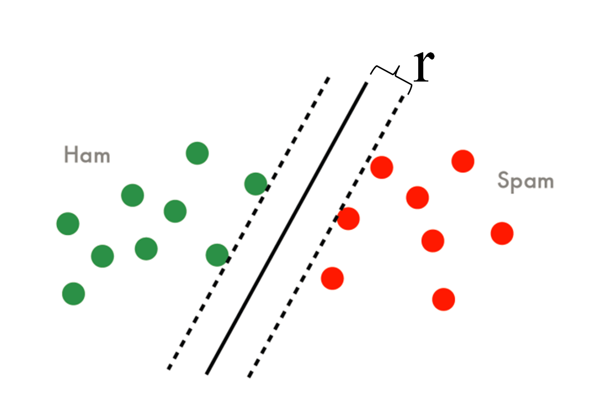

<a name="content">目录</a>

[理解机器学习](#title)
- [1. 理解极大似然估计和EM算法](#maximize-likelihood-estimation-and-expection-maximum)
    - [1.1. 搞懂极大似然估计与EM算法定义及理清它们间的关系](#make-sense-the-defination-and-relationship-of-MLE-EM)
    - [1.2. 盘一盘优化目标求解的那些小九九](#dissuse-solving-methods-of-optimization-objective)
        - [1.2.1. 两种优化问题：有约束与无约束](#2-type-optimization-objective)
        - [1.2.2. 两种求解策略](#2-type-solving-methods)
    - [1.3. EM算法的优化思想](#principle-of-em-algorithmn)
    - [1.4. 类比损失函数最小化与梯度下降法](#analogy-mle-em-with-minimize-loss-function-and-gradient-descent)

<h1 mame="title">理解机器学习</h1>

<a name="maximize-likelihood-estimation-and-expection-maximum"><h2>1. 理解极大似然估计和EM算法 [目录](#content)</h2></a>

<a name="make-sense-the-defination-and-relationship-of-MLE-EM"><h3>1.1. 搞懂极大似然估计与EM算法定义及理清它们间的关系 [目录](#content)</h3></a>

---

写在最前面的结论：

极大似然估计和EM算法都是对于概率模型而言的

极大似然是对概率模型参数学习优化目标的一种定义

EM算法是用于求解极大似然估计的一种迭代逼近的算法

---

机器学习的一大重要任务：

> 根据一些已观察到的证据（例如训练样本）来对感兴趣的未知变量（例如类别标记）进行估计

那么对于上面的任务，一种有效的实现途径就是使用**概率模型**

概率模型的本质是，将机器学习任务归结为计算变量的概率，其核心是基于可观测变量推断出位置变量的条件分布

> 假定所关心的变量的集合为Y，可观测变量集合为O，不可观测变量集合为I，则完全变量$U=\{O,I\}$，且$Y\subset U$
>
> 则基于概率模型的机器任务可以形式化地表示为
>
> $$Y^*=arg \max_Y P(Y \mid O,\theta)$$
>
> 即，对于已经训练好的模型$\theta$，给定一组观测值O，且已知感兴趣的未知变量Y的可能取值范围，计算出所以可能的$P(Y \mid O,\theta)$，那个概率最大的Y就是模型给出的判断

那么，如何从预先给出的训练数据集学习出概率模型的参数$\theta$呢？

（1）定义优化目标——**极大似然估计**

一般使用**极大似然估计**

极大似然估计 (maximize likelihood estimation, MLE)：

> 在概率模型中，给定观测数据作$O$为模型的训练样本，训练出对应的概率模型，即得到模型的参数$\theta$，使得基于此模型的产生观测数据的条件概率（称为似然）$P(O\mid \theta)$最大化
>
> 所以极大似然估计是概率模型的一种优化方法，可以表示为
>
> $$\theta^*=arg \max_{\theta}P(O \mid \theta)$$

前面已经提到了，在概率模型中，有时既含有可观测变量 (observable variable) O，又含有隐藏变量或潜在变量(latent variable) I

- 若只含有观测变量

    比如，贝叶斯分类器，可以不仅观测到每个样本的features（假设所有的与模型相关的features都被观测到了），还可以知道每个样本所属的类别，则没有隐变量，即$U=\{O,I\},而I=\emptyset,则U=O$

    则此时，给定数据，可以直接用极大似然估计法来估计模型参数

    $$\theta^*=arg \max_Y P(O \mid \theta)$$

- 若含有隐变量

    比如，隐马尔可夫模型 (hidden markov model, HMM)

    

    则此时的优化目标仍然是极大似然估计(MLE)，但是是含有隐变量的极大似然估计，即

    $$\theta^*=arg \max_Y P(O \mid \theta)=arg \max_Y \sum_I P(O,I\mid \theta)$$

（2）求解优化目标

上面我们已经谈论了概率模型参数学习的一般步骤的第一步，即用极大似然估计来定义我们的优化目标

且对于可观测数据的不同，把极大似然估计分成了两种情况，即观测数据是完全数据$O \subseteq U$的情况，和观测数据是不完全数据$O\subsetneq U$的情况

$$
\theta^*=
\begin{cases}
arg \max_Y P(O \mid \theta) , &  if \quad O \subseteq U \\
arg \max_Y \sum_I P(O,I\mid \theta), & if \quad O\subsetneq U
\end{cases}
$$

而对于完全数据和不完全数据，极大似然估计的求解难度是不一样的：

> - 对于完全数据，它的优化目标中只含有待求解的$\theta$，使用常规的优化目标求解法即可，例如梯度下降、拟牛顿法，或者直接导数法也可以；
>
> - 对于不完全数据，其中有隐变量I的干扰，所以要想直接求解$\theta$是无法做到的

那么怎么解决含有隐含变量的极大似然估计？

这便是EM算法要做的事

<a name="dissuse-solving-methods-of-optimization-objective"><h3>1.2. 盘一盘优化目标求解的那些小九九 [目录](#content)</h3></a>

**读者背景知识：线性回归、逻辑回归、SVM、最大熵模型、拉格朗日乘子法**

说在前面的废话：

> 前面已经讲清楚了最大似然估计(MLE)与EM算法的关系，按照计划，是要讨论EM算法求解优化问题的思想的
>
> 不过细想，优化目标求解问题其实就那么几种，而EM算法只不过是其中某种大类求解策略下的一种具体实现而已，一个是道，一个是术，道的高度是大于术的，讲清楚了道，则一通百通，术便不再是问题
>
> 所以，这一节，我就给大家理一理那些优化目标求解问题中的几大求解策略

<a name="2-type-optimization-objective"><h4>1.2.1. 两种优化目标：有约束与无约束 [目录](#content)</h4></a>

首先，大家要知道，优化目标按照是否有额外的约束条件可以分为以下两种情况：

- **无约束的最优化问题**

    这种情况是最常见的，也是比较容易求解的优化问题
    
    比如：
    
    （1）线性回归的损失函数最小化目标（又称为最小二乘法）：

    $$\min_w \frac 12 \sum_{i=1}^m(h(x_i)-y_i)^2$$

    如果再在原始最小二乘法损失函数的基础上加上正则化项，又变成了新的优化目标：

    $$\min_w \frac 12 \sum_{i=1}^m(h(x_i)-y_i)^2+\lambda\sum_{j=1}^n|w_i|\quad LASSO$$

    $$\min_w \frac 12 \sum_{i=1}^m(h(x_i)-y_i)^2+\lambda\sum_{j=1}^n|w_i|_2^2\quad \text{岭回归}$$

    其中，$\lambda$是正则化项的系数，用于权衡模型结构风险与经验风险的比重，可以看到LASS回归于岭回归的差别仅仅在于使用的正则化项而已，LASS使用的是L1正则化，岭回归使用的是L2正则化

    （2）逻辑回归的最大对数似然估计：

    $$
    \begin{aligned}
    &\max_w \log\prod_{i=1}^m P(y_i \mid x_i) \\
    &= \log\prod_{i=1}^m P(y_i=1 \mid x_i)^{y_i}P(y_i=0 \mid x_i)^{1-y_i} \\
    &= \sum_{i=1}^m y_i\log P(y_i=1 \mid x_i)+(1-y_i)\log(1-P(y_i=1 \mid x_i))
    \end{aligned}
    $$

    其中，

    $$
    h(x)=P(y=1\mid x)=\frac{1}{1+e^{wx}}\\
    P(y=0\mid x)=1-P(y=1\mid x)=\frac{e^{wx}}{1+e^{wx}}
    $$

    则，优化目标可以写成：

    $$\max_w \sum_{i=1}^m y_i\log h(x_i)+(1-y_i)\log(1-h(x_i))$$

- **有约束的最优化问题**

    这一类优化问题除了有目标函数项，还有其他约束项

    比如：

    （1）支持向量机的最大化几何间隔 (max margin)

    它的优化目标为最大化几何间隔，即

    $$\max_w r=\frac {\hat r}{||W||}$$

    

    其中，$r$是样本集合在样本空间的几何间隔（几何间隔：样本点到分界面的垂直距离），$\hat r$是函数间隔，几何间隔与函数间隔满足$r=\hat r/||W||$，$W$是分界超平面的系数向量，SVM的目标就是要让上图中的r最大化

    但是，这个优化目标还要满足额外的约束条件：

    $$r^{(i)}\ge r$$

    其中，$r^{(i)}$表示每个样本各自的几何间隔，很显然几何的几何间隔肯定要大于等于每个样本各自的几何间隔

    另外，根据几何间隔的定义，可以把上面的约束条件写成：

    $$y_i\frac{W^Tx_i}{||W||}\ge \frac{\hat r}{||W||}\quad \Rightarrow y_i(W^Tx_i)\ge \hat r$$

    则，完整的优化目标可以写成：

    $$
    \max_W \frac{\hat r}{||W||} \\
    s.t. \quad y_i(W^Tx_i)\ge \hat r \quad i=1,2,...,m
    $$

    为了简化优化目标，我们限定$\hat r=1$，则完整的优化目标可以写成：

    $$
    \max_W \frac{1}{||W||} \\
    s.t. \quad y_i(W^Tx_i)\ge 1 \quad i=1,2,...,m
    $$

    而我们习惯将优化目标写成最小化形式，所以，可以进一步改写成：

    $$
    \min_W \frac 12 ||W|| \\
    s.t. \quad 1-y_i(W^Tx_i)\le 0 \quad i=1,2,...,m
    $$

    （2）最大熵模型的极大化模型的熵

    对于给定的训练集$T=\{(x_1,y_1),(x_2,y_2),...,(x_N,y_N)\}$以及特征函数$f_i(x,y),\, i=1,2,...,n$，最大熵模型的学习等价于约束最优化问题：

    $$\max_{P\in C} H(P)=-\sum_{x,y} \hat P(x)P(y\mid x)\log P(y \mid x) \\
    s.t. \quad E_P(f_i)=E_{\hat P}(f_i), \, i=1,2,...,n \\
    \sum_y P(y \mid x)=1
    $$

    其中，$C$是满足约束条件的模型空间，$\hat P(x)$是训练样本的边际分布$P(x)$的经验分布，$E_{\hat P}(f)$是经验分布$\hat P(X,Y)$的期望值，$E_P(f)$是模型$P(y \mid x)$与经验分布$\hat P(X,Y)$的期望值，即

    $$E_{\hat P}(f)=\sum_{x,y} \hat P(x,y)f(x,y)$$

    $$E_P(f)=\sum_{x,y} \hat P(x)P(y \mid x)f(x,y)$$

对于上面谈到的两类优化目标，第一类无约束优化目标，它可以之间使用我们常用的最优化问题的求解方法（具体内容在后面展开）进行解决，而第二类，即有约束优化目标，则不能进行直接求解，需要先将它**转化为无约束优化目标**，然后再用求解无约束优化目标的方法进行求解

那么，如何将有约束优化目标转化为无约束优化目标呢？

需要使用**拉格朗日乘子法**

> 对于以下一般形式的带约束的优化问题（即有等式约束，又有不等式约束）
>
> $$\min_w f(w) \\ s.t. \quad g_i(w) \le 0, \, i=1,2,...,k \\ h_i(w)=0, \, i=1,2,...,l$$
>
> 引入拉格朗日乘子$\alpha_1,\alpha_2,...,\alpha_k,\beta_1,\beta_2,...,\beta_l$，定义拉格朗日函数$L(w,\alpha,\beta)$：
>
> $$L(w,\alpha,\beta)=f(w)+\sum_{i=1}^k \alpha_i g_i(w) + \sum_{i=1}^l \beta_i h_i(w)$$
>
> 则，在引入拉格朗日乘子法后，原先有约束优化问题就转化成了下面的无约束优化问题：
>
> $$\min_w max_{\alpha>0,\beta} L(w,\alpha,\beta)$$
>
> 至于为什么$f(w)$会等于$max_{\alpha>0,\beta} L(w,\alpha,\beta)$，由于文章篇幅有限，这里就不展开证明了

<a name="2-type-solving-methods"><h4>1.2.2. 两种求解策略 [目录](#content)</h4></a>

**读者知识背景：线性代数**

下面来讨论一下怎么求解优化问题

其实，任它优化问题千变万化，求解起来无非就是两种策略：

> - 标准方程法 (Normal equation method)
> - 迭代法 (iteration)

- 标准方程法

    它的基本思想其实非常简单，即假设目标函数是一个凸函数，那么它在定义域上的最优解一般来说，是在其极值点取到，那么我们就可以对目标函数求偏导数，且令各个偏导数的值为0，从而找出极值点，也就获得了最优解

    比如，对于线性回归问题，其优化目标（不进行正则化）为：

    $$\min_w \frac 12 \sum_{i=1}^m(h(x_i)-y_i)^2$$

    即

    $$\min_w \frac 12 \sum_{i=1}^m(W^Tx_i-y_i)^2$$

    记$f(W)=\frac 12 \sum_{i=1}^m(W^Tx_i-y_i)^2$

    为了方便后面的推导，用向量化形式来表示：

    $$f(W)=\frac 12 [XW-Y]^T[XW-Y]$$

    其中，

    $$W=(w_0,w_1,...,w_n)^T$$
    
    $$X=
    \begin{bmatrix}
    -x_1- \\
    -x_2- \\
    ... \\
    -x_m- 
    \end{bmatrix}
    $$

    $$Y=(y_1,y_2,...,y_m)^T$$
    
    则对模型参数的每一项求偏导数，得到

    $$
    \begin{aligned}
    \Delta_W f(W) &= \frac 12 \Delta_W [XW-Y]^T[XW-Y] \\
    &= \frac 12 \Delta_W (W^TX^TXW - W^TX^TY - Y^TXW+Y^TY) \\
    &= \frac 12 \Delta_W tr(W^TX^TXW - W^TX^TY - Y^TXW+Y^TY) \\
    &= \frac 12 \Delta_W tr(WW^TX^TX - Y^TWX - Y^TXW)
    \end{aligned}
    $$

    而
    
    $$
    \Delta_W tr(WW^TX^TX)=X^TXWI + X^TXWI \\
    \Delta_W tr(Y^TXW)=X^TY
    $$

    因此

    $$\Delta_W f(W)=\frac 12 [X^TXW + X^TXW - X^TY- X^TY]=X^TXW-X^TY$$

    所以，$X^TXW=X^TY \Rightarrow W=(X^TX)^{-1}Y$

    上面的推导过程，涉及到比较深的线性代数的知识，尤其是关于矩阵的迹相关的知识，看不懂没有关系，上面讲这么多只是想说明，可以通过对目标函数求导并让导数为0来得到解

- 迭代法

    像我们最熟悉的梯度下降法以及牛顿法或拟牛顿法都属于迭代求解的方法，包括我们下一节要进一步讨论的EM算法也属于迭代法

    它们的基本思想为：

    > 与标准方程法**一步到位**获得最优解的策略不同，迭代法先找一个随机解做为起始的当前解，然后对当前解进行迭代更新，保证每一次迭代后得到的新解朝着最优化的方向前进，即
    >
    > 若最优化目标为：
    >
    > $$\min_W f(W)$$
    >
    > 则找到一种解的更新方法，实现$W\to W+\delta$，保证
    >
    > $$f(W_{i+1})\le f(W_i)$$
    >
    > 不断迭代，直到目标函数不再朝着优化目标改变为止，即解已经收敛了，此时的解W即为最优解
    >
    > 不过**迭代法不能保证收敛到的解是全局最优，它很可能落到局部最优位置**

    区别具体的迭代法的，是它们各自所采用的参数更新的方法

    比如梯度下降法的参数更新的方法为：

    $$W \to W - \alpha \Delta f(W)$$

<a name="principle-of-em-algorithmn"><h3>1.3. EM算法的优化思想 [目录](#content)</h3></a>

<a name="analogy-mle-em-with-minimize-loss-function-and-gradient-descent"><h3>1.4. 类比损失函数最小化与梯度下降法 [目录](#content)</h3></a>

---

参考资料：

(1) 周志华《机器学习》

(2) 李航《统计学习方法》

(3) 吴军《数学之美》

(4) 兰艳艳《SVM算法》，国科大《模式识别与机器学习》课程

(5) 吴恩达《斯坦福大学·机器学习》公开课

(6) 机械工业出版社《机器学习实战：基于Scikit-Learn和TensorFlow》
